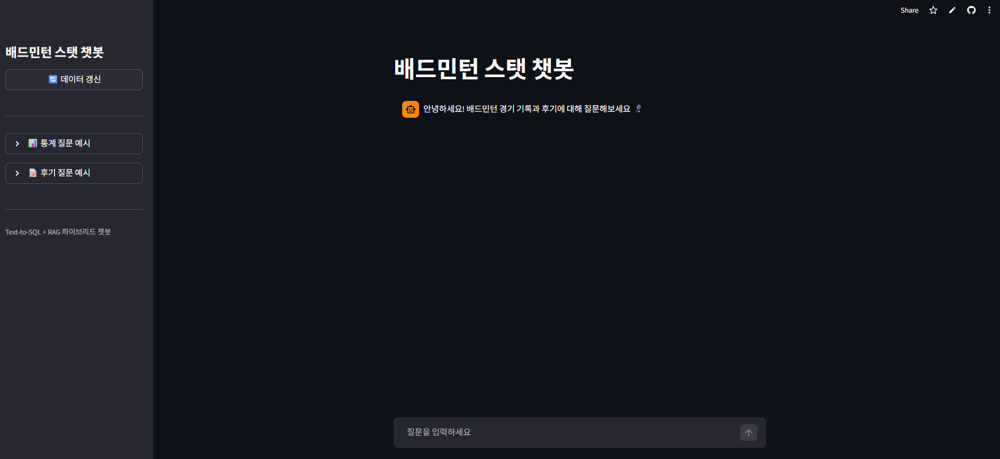
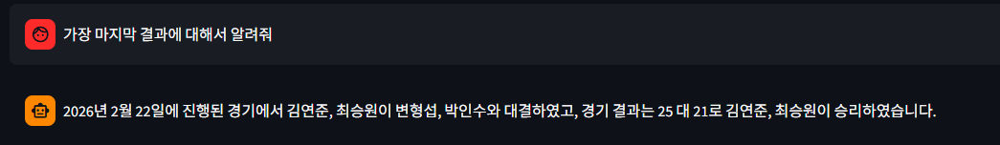
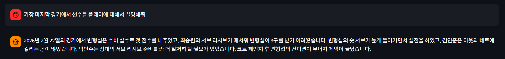

# 🏸 Badminton Stats Chatbot

> 배드민턴 경기 기록 데이터를 기반으로 자연어로 질문할 수 있는 챗봇

🔗 **[Live Demo](https://bm-stats-chatbot.streamlit.app/)**

## 📌 프로젝트 소개

Google Sheets에 기록된 배드민턴 경기 데이터를 SQLite DB로 변환하고, 경기 후기 텍스트 데이터를 FAISS Vector DB에 저장하여 자연어 질문에 답하는 하이브리드 챗봇입니다.

- **통계 질문** → Text-to-SQL 방식으로 SQLite DB에서 정확한 수치 조회
- **후기/메모 질문** → RAG 파이프라인으로 FAISS Vector DB에서 유사 문서 검색

## 📸 스크린샷

**챗봇 메인 화면**


**통계 질문 답변 예시**


**후기 질문 답변 예시**


## 🛠 기술 스택

| 분류 | 기술 |
|---|---|
| Language | Python 3.13 |
| Database | SQLite, FAISS |
| Framework | LangChain, Streamlit |
| Data | Google Sheets API (gspread) |
| LLM | OpenAI GPT-4o-mini |
| Embedding | OpenAI Embeddings |

## 📁 프로젝트 구조

```
badminton-stats-chatbot/
├── src/
│   ├── __init__.py
│   ├── db_loader.py    # Google Sheets → SQLite 변환
│   ├── rag_loader.py   # 경기 후기 RAG 파이프라인
│   ├── chain.py        # LangChain Text-to-SQL + RAG 체인
│   └── prompts.py      # 프롬프트 템플릿
├── assets/             # 스크린샷 이미지
├── data/
│   └── reviews/        # 경기 후기 텍스트 파일
│       └── sample_review.txt
├── db/
│   ├── badminton.db    # SQLite DB
│   └── faiss/          # FAISS Vector DB
├── streamlit_app.py    # Streamlit 메인 앱
├── requirements.txt
└── .env.example
```

## ✨ 주요 기능

- Google Sheets 데이터 실시간 연동
- Google Sheets 경기기록 기반 통계 자동 계산 (개인/조합)
- 시즌 컬럼 기반 자동 시즌 감지 및 분류
- 자연어 질문 → SQL 자동 변환 (Text-to-SQL)
- 경기 후기 기반 RAG 파이프라인 (FAISS Vector DB)
- 질문 유형에 따라 Text-to-SQL / RAG 자동 분기
- 시즌별 / 전체 경기 데이터 조회
- 개인 통계 및 파트너 조합 승률 조회
- 사이드바 데이터 갱신 버튼으로 실시간 업데이트

## ⚙️ 실행 방법

**1. 패키지 설치**
```bash
pip install -r requirements.txt
```

**2. 환경변수 설정**

`.env.example`을 참고하여 `.env` 파일을 생성하세요.

```bash
SPREADSHEET_URL=your_spreadsheet_url
OPENAI_API_KEY=your_openai_api_key
```

**3. SQLite DB 생성**
```bash
python src/db_loader.py
```

**4. Vector DB 생성**
```bash
python src/rag_loader.py
```

**5. 앱 실행**
```bash
streamlit run streamlit_app.py
```

## 📊 데이터 구조

**Google Sheets**

| 시트 | 설명 |
|---|---|
| 경기기록 | 경기 결과 입력 (시즌 컬럼으로 구분) |

**SQLite DB (자동 생성)**

| 테이블 | 설명 |
|---|---|
| match_records | 경기기록 |
| player_stats | 개인 통계 (전체 + 시즌별 자동 계산) |
| pair_stats | 파트너 조합 통계 (전체 + 시즌별 자동 계산) |

**FAISS Vector DB**

| 데이터 | 설명 |
|---|---|
| reviews/ | 경기 후기 텍스트 파일 |

## 🔜 향후 개선 사항

- OCR 기반 외부 경기 결과 이미지 업로드 기능
- 다양한 이미지 형식 파싱 지원
- 시즌별 통계 비교 기능 추가