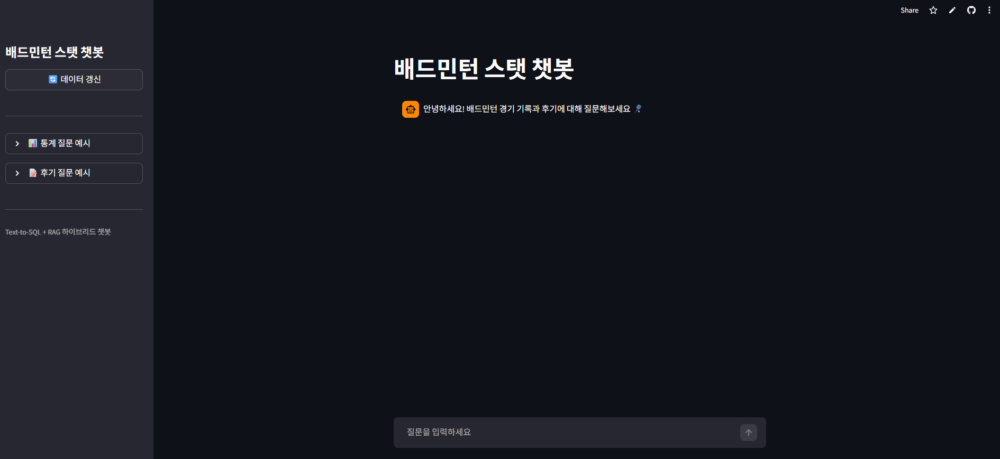
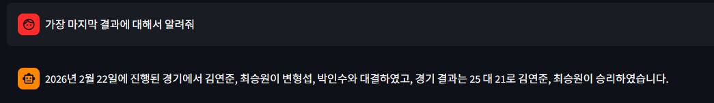
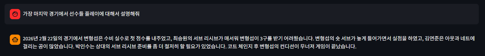

# 🏸 Badminton Stats Chatbot

> 배드민턴 경기 기록 데이터를 기반으로 자연어로 질문할 수 있는 챗봇

🔗 **[Live Demo](https://bm-stats-chatbot.streamlit.app/)**

## 📌 프로젝트 소개

Google Sheets에 기록된 배드민턴 경기 데이터를 SQLite DB로 변환하고, 경기 후기 텍스트 데이터를 FAISS Vector DB에 저장하여 자연어 질문에 답하는 하이브리드 챗봇입니다.

- **통계 질문** → Text-to-SQL 방식으로 SQLite DB에서 정확한 수치 조회
- **후기/메모 질문** → RAG 파이프라인으로 FAISS Vector DB에서 유사 문서 검색

## 📸 스크린샷

**챗봇 메인 화면**


**통계 질문 답변 예시**


**후기 질문 답변 예시**


## 🛠 기술 스택

| 분류 | 기술 |
|---|---|
| Language | Python 3.13 |
| Database | SQLite, FAISS |
| Framework | LangChain, Streamlit |
| Data | Google Sheets API (gspread) |
| LLM | OpenAI GPT-4.1-mini |
| Embedding | OpenAI Embeddings |
| Calendar UI | streamlit-calendar (FullCalendar) |

## 📁 프로젝트 구조

```
badminton-stats-chatbot/
├── src/
│   ├── __init__.py
│   ├── db_loader.py    # Google Sheets → SQLite 변환
│   ├── rag_loader.py   # 경기 후기 RAG 파이프라인
│   ├── chain.py        # LangChain Text-to-SQL + RAG 체인
│   ├── dashboard.py    # 대시보드 차트 렌더링
│   └── prompts.py      # 프롬프트 템플릿
├── assets/             # 스크린샷 이미지
├── data/
│   └── reviews/        # 경기 후기 텍스트 파일 (YYYYMMDD.txt)
├── db/                 # 런타임 자동 생성
│   ├── badminton.db    # SQLite DB
│   └── faiss/          # FAISS Vector DB
├── streamlit_app.py    # Streamlit 메인 앱
├── requirements.txt
└── .env
```

## ✨ 주요 기능

**챗봇**
- 자연어 질문 → SQL 자동 변환 (Text-to-SQL)
- 경기 후기 기반 RAG 파이프라인 (FAISS Vector DB)
- 질문 유형(통계/후기)에 따라 Text-to-SQL / RAG 자동 분기
- "최근/마지막" 키워드 감지 시 SQL로 최신 날짜 확정 후 RAG 검색

**대시보드**
- 총 경기 수, 최다승 선수, 최고 승률, 등록 선수 수 KPI 카드
- 선수별 승률 바 차트
- 파트너 조합 TOP 5 승률 차트
- 득실차 랭킹 차트
- 시즌별 필터링

**후기 작성 (로컬 전용)**
- 월간 달력 UI — 경기 있는 날짜(초록), 후기 작성된 날짜(파랑) 색상 구분
- 날짜 클릭 시 해당 날짜 경기 목록 및 기존 후기 자동 로드
- 후기 저장 후 FAISS Vector DB 자동 재생성
- 비밀번호 인증 게이트 (로그인/로그아웃)

**공통**
- Google Sheets 데이터 실시간 연동 및 갱신
- 개인 통계 및 파트너 조합 승률 자동 계산 (전체 + 시즌별)
- 첫 실행 시 SQLite DB / FAISS Vector DB 자동 생성

## ⚙️ 실행 방법

**1. 패키지 설치**
```bash
pip install -r requirements.txt
```

**2. 환경변수 설정**

`.env` 파일을 생성하고 아래 항목을 입력하세요.

```env
OPENAI_API_KEY=your_openai_api_key
SPREADSHEET_URL=your_google_sheets_url
REVIEW_PASSWORD=your_review_password   # 후기 작성 탭 비밀번호
REVIEW_ENABLED=true                    # 후기 작성 탭 활성화 (로컬 전용)
```

**3. Google 인증 설정**

서비스 계정 키 파일(`credentials.json`)을 프로젝트 루트에 배치하세요.

**4. 앱 실행**
```bash
streamlit run streamlit_app.py
```

> DB와 Vector DB는 첫 실행 시 자동으로 생성됩니다.

## ☁️ Streamlit Cloud 배포

Secrets에 아래 항목을 추가하세요. `REVIEW_ENABLED`는 추가하지 않으면 후기 작성 탭이 자동으로 비활성화됩니다.

```toml
OPENAI_API_KEY = "your_openai_api_key"
SPREADSHEET_URL = "your_google_sheets_url"
REVIEW_PASSWORD = "your_review_password"
GOOGLE_CREDENTIALS = '{"type": "service_account", ...}'  # credentials.json 내용
```

## 📊 데이터 구조

**Google Sheets**

| 시트 | 설명 |
|---|---|
| 경기기록 | 날짜, 팀A-1, 팀A-2, 팀B-1, 팀B-2, 점수A, 점수B, 승리팀, 시즌 |

**SQLite DB (자동 생성)**

| 테이블 | 설명 |
|---|---|
| match_records | 경기기록 원본 |
| player_stats | 개인 통계 (전체 + 시즌별 자동 계산) |
| pair_stats | 파트너 조합 통계 (전체 + 시즌별 자동 계산) |

**경기 후기 (`data/reviews/`)**

- 파일명 형식: `YYYYMMDD.txt`
- 후기 작성 탭에서 작성·수정 후 저장하면 FAISS Vector DB에 자동 반영
